# Juniper-vMX

Automatic deployment of the multi-VM Juniper virtual MX (vMX) router on vSphere and OpenStack

A request to deploy a vMX router is modeled as a template resource added to the blueprint, 
instead of an app or service. This is so the user can interactively connect vMX ports to other components
before the vMX has actually been deployed, eliminating the need to manually type values for connector attributes.

The vMX is represented to the user as an autoloaded resource that should be indistinguishable from a 
hardware MX router. Juniper gen1 and gen2 shells are both supported. Other resources created during the
deployment are admin-only and hidden from the end user. The vMX resource is connected to the underlying VMs 
with a virtual L2 resource explained below. 

Point-to-point and VLAN service connections are fully supported.

vMX VM images from Juniper are deployed using `vSphere Deploy from Linked Clone` and 
`OpenStack Deploy From Glance Image` from standard cloud providers. 

Tested with vMX release 17.1R1.8

Uses general-purpose setup and teardown hooks: https://github.com/ericrqs/Setup-Teardown-Hooks

Protects against conflicting updates to the reservation using this mutex mechanism: https://github.com/ericrqs/Reservation-Mutex-Lock 

Blueprint with two back-to-back vMX requests: 
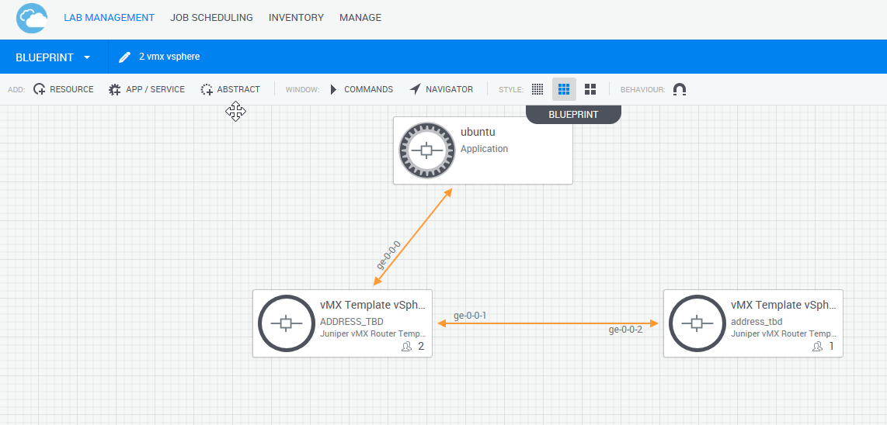

Two deployed vMX connected back-to-back, non-admin user view:
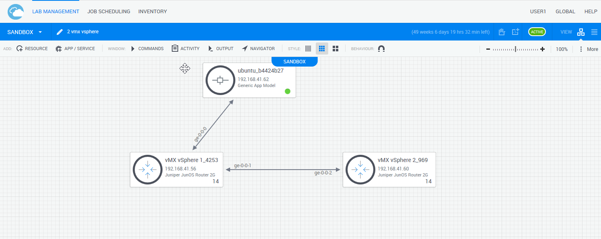

Two deployed vMX connected back-to-back, admin view with admin-only items visible:
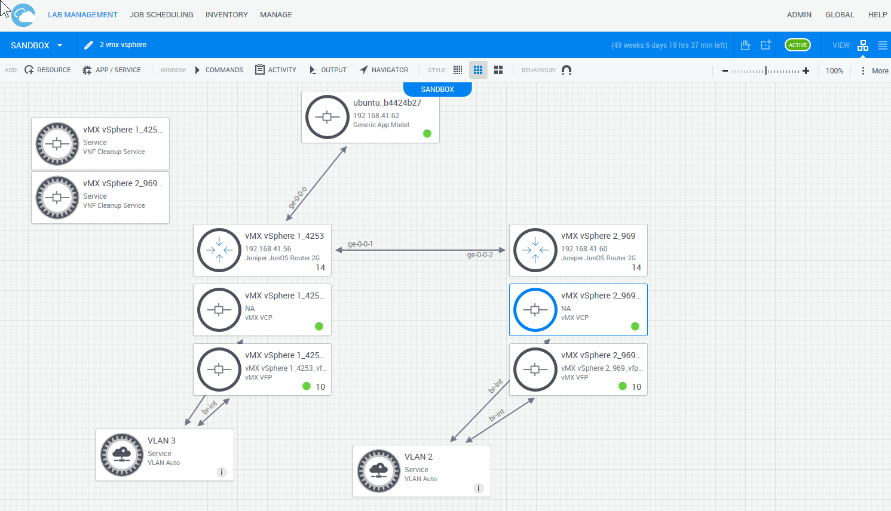

## vMX Basics

A vMX is a set of VMs that behaves the same as an MX router. It can be autoloaded by Quali gen1 and gen2 Juniper shells. 
Both kinds of shell are supported in the vMX deployment.    
 
A vMX consists of one controller VM, which presents the same interface as the MX, and one or more 
card VMs linked to the controller. A NIC on a card will show up as an interface like ge-0/0/0 on 
the controller in the JunOS CLI. The controller and its cards cards are linked via an isolated network unique 
to each vMX instance. 

In CloudShell, the vMX VMs are hidden admin-only resources, and the vMX is represented by a resource 
with the Juniper shell model. The translation from the familiar Juniper MX resource interface to underlying VMs takes place 
in the background. 
 
The following are synonyms:

**Controller, VCP (virtual control plane), RE (routing engine)**

**Card, VFP (virtual forwarding plane), PFE (packet forwarding engine)**

A vMX controller communicates with its cards over a dedicated network connected to the second NIC on all VMs.
On the second NIC, the controller has a hard-coded IP of `128.0.0.1`, and cards set their IP to 
`128.0.0.16` for card 0, `128.0.0.17` for card 1, etc. 
The vMX automatically sets itself up by sending discovery messages over the `128.0.0.0` network.

Note: On OpenStack vMX may only officially support one card.

## User workflow

Drag a vMX template resource into a blueprint

Draw connectors to other elements in the blueprint

Ensure that Default Setup and Default Teardown have been replaced by hook_setup and hook_teardown
in blueprint properties. 

Reserve a new sandbox

The vMX will appear indistinguishable from any other Juniper MX router resource.  

At any time after deployment, you can add more connectors going to the deployed vMX. Run Connect 
manually on each connector, or just run Setup again, and and it should connect all unconnected connectors.
  
Note: On OpenStack, if you run Connect manually on connectors, you must do so in ascending order by vMX interface address.  

## Use in an existing sandbox

You can add a vMX template resource to an existing sandbox and connect it to other components there.

Make connections to either the vMX template before deploying or the vMX resource after deploying.

To deploy the vMX, run the function orch_hook_during_provisioning on the vMX template resource. 

The vMX will be automatically deleted by Teardown if hook_teardown is attached to the blueprint. If the blueprint still has
the default Teardown, you will need to manually delete the vMX and the associated virtual L2 resources after
the sandbox has ended.   

## vMX package installation

### General
Install the hook setup and teardown scripts: https://github.com/ericrqs/Setup-Teardown-Hooks

On any blueprint that needs to deploy a vMX, attach hook_setup and hook_teardown scripts to the sandbox in 
place of Default Setup and Default Teardown. It is recommended to set hook_setup and hook_teardown as the systemwide 
default Setup and Teardown scripts.
  

Drag vMX_Package.zip into the portal.

Create a vCenter or OpenStack cloud provider.

Create at least one vMX template resource. Add multiple port subresources with resource names like:
 
    ge-0-0-0 (first port on card 0)
    ge-0-0-1
    ...
    ge-0-0-9
    ge-1-0-0 (first port on card 1)
    ge-1-0-1
    ...

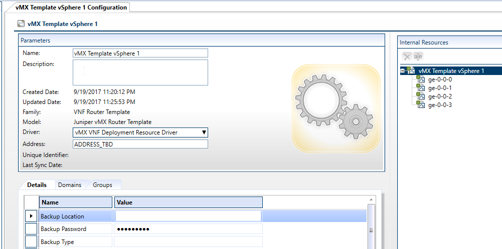
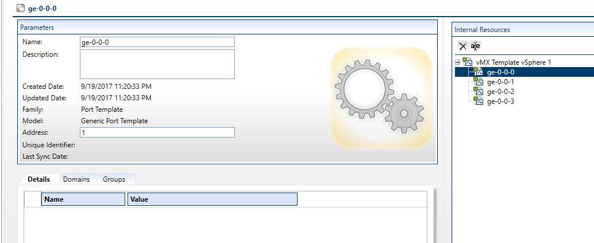

The first number in the port name is the card number, the middle number is always 0, and the last number is the port number.
Note that `/` in the JunOS name `ge-0/0/0` is replaced with `-` in all CloudShell resource names in the vMX deployment and in both
generations of the JunOS shell.

Create enough port subresources to cover all your scenarios.

Note that on vSphere, the vNICs must also be added statically to the card prototype VM in vSphere ahead of time. 
The first 3 NICs are reserved, so make sure the card template VM has 4-13 vNICs in order to 
support 1-10 traffic interfaces. vMX has a limit of about 10 traffic interfaces per card. 
There may be issues with interfaces beyond the 7th.
 

Set attribute VLAN Type on the vMX template resource:
- vSphere: Always **VLAN**
- OpenStack: **VLAN** or **VXLAN** to match the setting on the OpenStack cloud provider
    

Import the gen1 or gen2 shell for Juniper JunOS routers.

Set the attributes on the vMX template resource to match the Juniper shell:

- For the gen1 Juniper shell:
    - Deployed Resource Family: **Router**
    - Deployed Resource Model: **Juniper JunOS Router**
    - Deployed Resource Driver: **Generic Juniper JunOS Driver Version3**
- For the gen2 Juniper router shell:
    - Deployed Resource Family: **CS_Router**
    - Deployed Resource Model: **Juniper JunOS Router 2G**
    - Deployed Resource Driver: **Juniper JunOS Router 2G**

Create vMX template resources with multiple port subresources named ge-0-0-0, ge-0-0-1, ..., ge-1-0-0, ge-1-0-1, 
where 

Set other attributes that will be copied to the attributes of the vMX end product.

You must set certain attributes in order for the vMX to autoload properly: 
- SNMP Version: v2c
- SNMP Community String: public
- Enable SNMP: must be True
- User: user to create
- Password: password to set
- Enable Password: must be same as Password
- Backup Password: must be same as Password

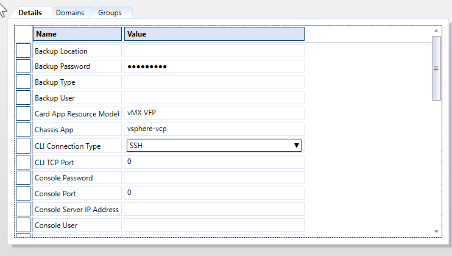
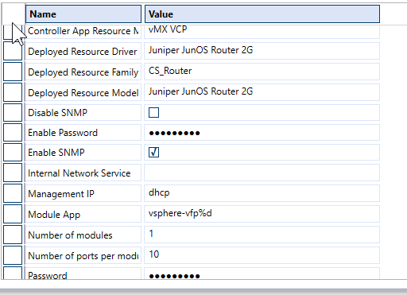
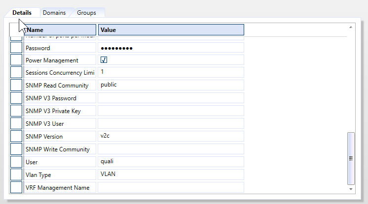

Only Password will be used. It will be set as the password for the specified user and also for root. 
Enable Password should be identical to Password. 

 
 
### vSphere-specific

Important: In Resource Manager, Resource Families, Deployment Options family, 
VCenter Deploy VM From Linked Clone, change Wait for IP to be a user input, or 
change the default to false. On all vMX-related apps, Wait for IP must be false.
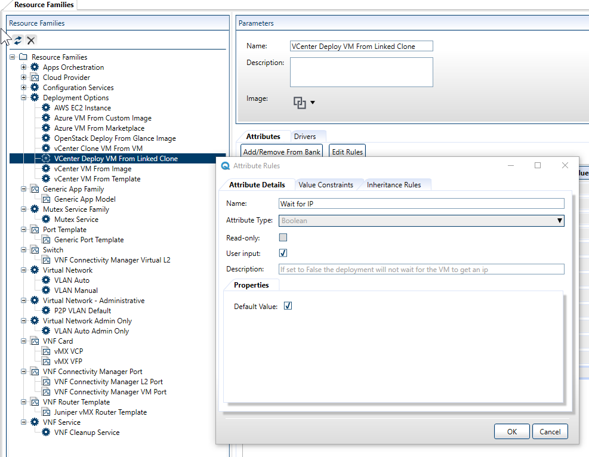

In the vSphere client, for each potential ESXi host where the controller VM could get 
deployed, go to Configuration tab, Software section, Security Profile, Firewall, 
Properties... and enable "VM serial port connected over network" (not "VM serial port 
connected to vSPC"). If needed, you can click the Firewall button while standing on 
"VM serial port connected over network" and enable the access only for the IP of the execution server. 
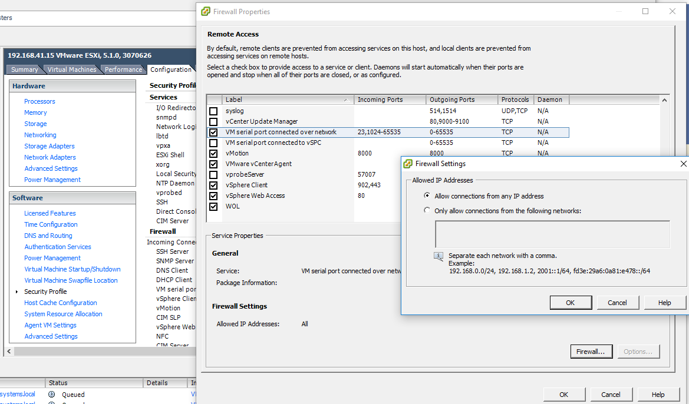
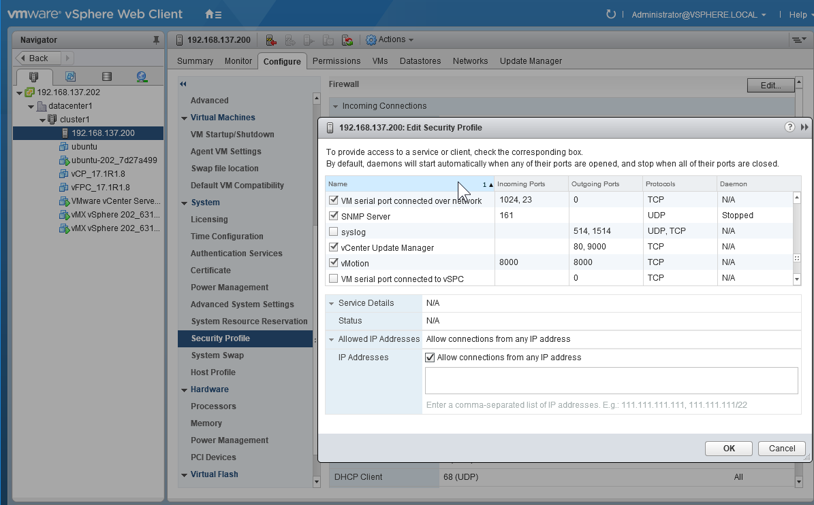

#### Controller
Import the 'vCP' template from Juniper. After importing the OVA, ensure that the VM is set to have 
at least 2048MB of memory. By default it receives so little memory that it can't boot.

Connect 'Network adapter 1' to your management network.

Power on the controller VM. Note that it may freeze for many minutes, sending output only 
to the serial console. Eventually it should many print FreeBSD boot messages and reach a login: prompt 
in the vSphere console.

Log in as 'root' with no password and run 'halt'. Wait a short time for the system to shut down. Power off the VM. 

Take a snapshot of the VM. Be sure to take the snapshot only after VM settings including NICs, and after booting at least once.
If you take a series of snapshots, be sure to note the full snapshot path from the tree under 'Manage Snapshots', `e.g. ss1/ss2/ss3`.

Create an app for the controller.

Be sure to set Wait for IP to False. If it is not visible, make the setting a user input in Resource Manager.

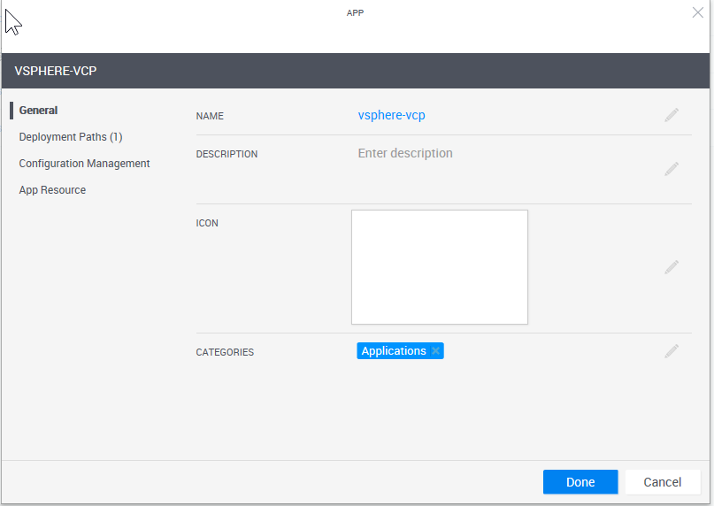
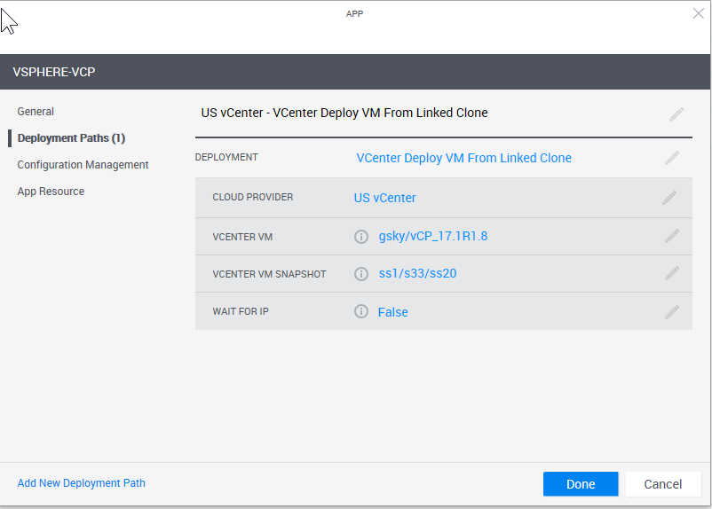
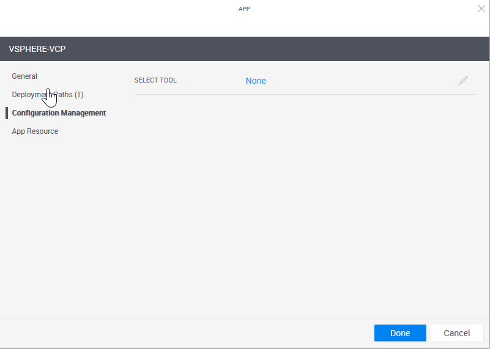

#### Cards

Import the VFP OVA. Ensure that the VFP VM has at least 4096MB of RAM. Otherwise it will fail to handshake with the VCP.

Take a snapshot of the card VM immediately with a name like `ss`. 

For every card you want to deploy, including card 0, you must set the card id on the VM
and take a snapshot. The factory image may start with card id 3, which will crash the automation.

For each card including 0:
- Revert the VM to the first snapshot `ss`
- Boot the VM
- Log in as root/root
- Write the desired card id to a file called `/var/jnx/card/local/slot`. For example, for card 0:

        mkdir -p /var/jnx/card/local
        echo 0 > /var/jnx/card/local/slot
        reboot
        
- Log in again as root/root
- Ensure that the card id file has influenced the IP on interface 'int' using `ifconfig`. 
For example for card 1 it should display `128.0.0.17`.
        
- Shut down the VM OS: `halt`
       
- Power off the VM
- Take a snapshot with the card id in the name, e.g. `card1`

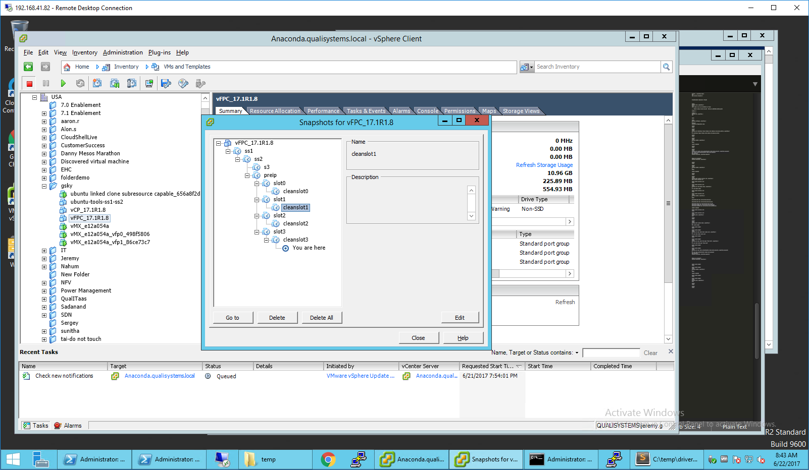

For each card snapshot, create a separate app. Use a naming convention for the apps. You will need to specify the name
on the vMX template with `%d` representing the card number. For example, if you name the card apps `vsphere-vfp0` and 
`vsphere-vfp1`, on the vMX template resource set Module App to `vsphere-vfp%d`.

Creating the app vsphere-vfp0 for card 0:
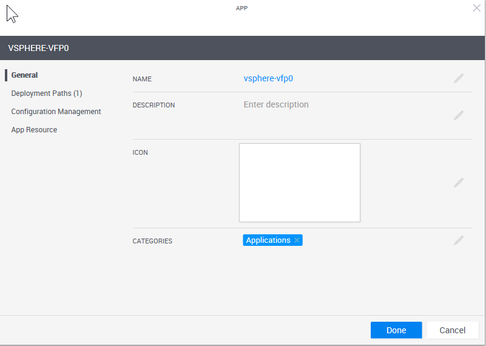

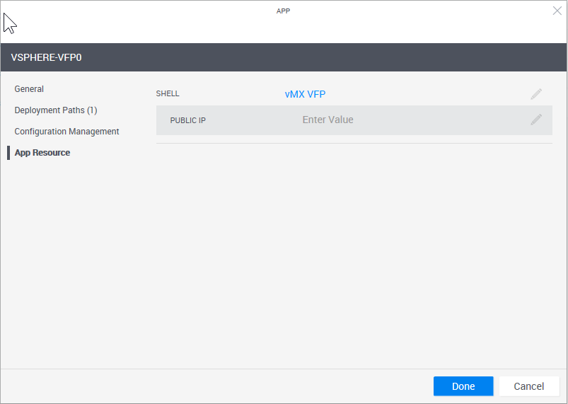

Difference in snapshot name for vsphere-vfp1 for card 1:
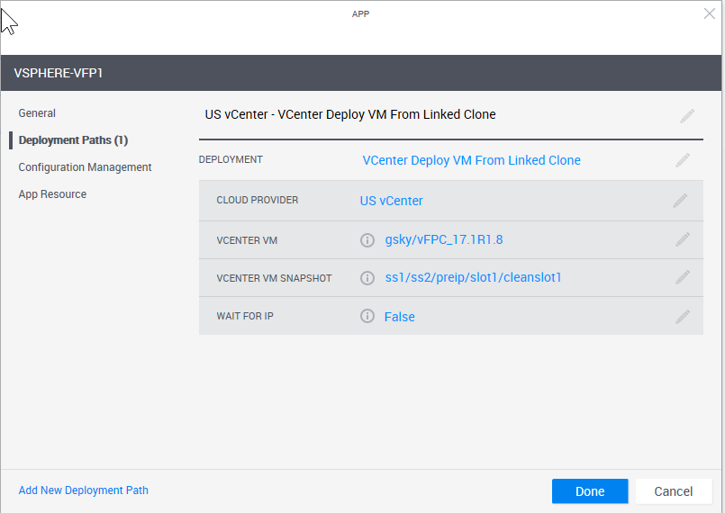

#### VLAN service
On vSphere, the deployment will automatically add an Auto VLAN service to the sandbox for the internal network. If you need to hide this
VLAN service from the user in the sandbox, copy the Virtual Network service family in Resource Manager and set the copy to admin-only. 
Rename the new Auto VLAN_1 as needed. Provide the model name of the new admin-only auto VLAN service in 
the Internal Network Service attribute on the vMX template resource.

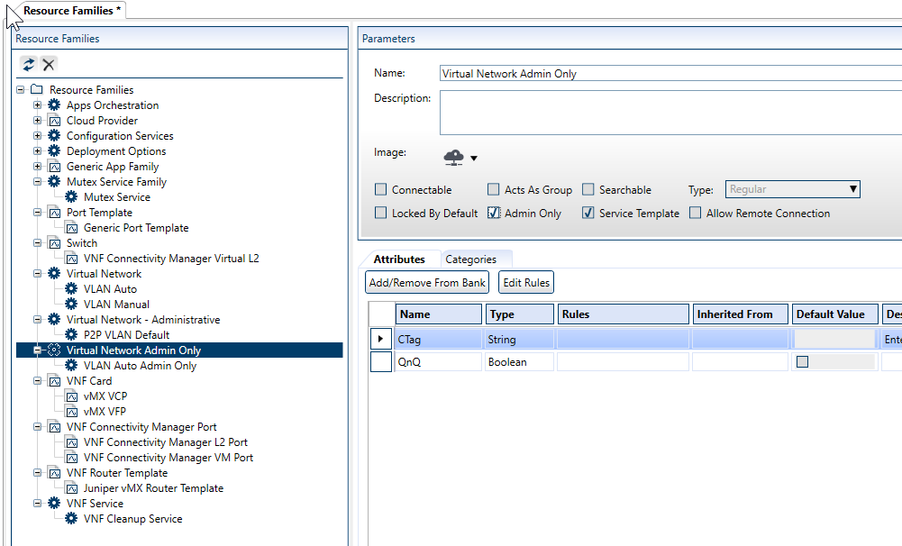

    
### OpenStack-specific

#### OpenStack system configuration

Tested configuration:

    CentOS Linux release 7.3.1611  (Core)
    Four physical NICs: enp3s0f0 enp4s0f0 connected, enp3s0f1 enp4s0f1 not connected
    OpenStack Newton
    
Note: vMX is very sensitive to OpenStack network settings. If the `128.0.0.0` network is not working, 
the VCP will not detect the VFP and will not show interfaces like `ge-0/0/0`. Even when `ge-0/0/0` appears,
actual traffic may not be able to pass through the VFP interface, so for example the vMX can't ping something on the ge-0/0/0 interface.

After a lot of trial and error, we found the following combination of settings that works under OpenStack Newton.
This is needed even if deploying manually with the official Juniper Heat scripts. We would appreciate any further insight or guidance.

- Firewall settings: security groups enabled in two places, specific driver selections:
    - `ml2_conf.ini`
        - `firewall_driver = None`
        - `enable_security_group = True`
    -  `openvswitch_agent.ini`
        - `firewall_driver = openvswitch`
        - `enable_security_group = True`
- We _enable_ the `port_security` plugin in order to be able to _disable_ port security on the `128.0.0.0` network ports (programmatically)
- When we create the `128.0.0.0` network and ports, we
    - turn off security groups
    - disable port security 
- Ensure that the MTU on the `128.0.0.0` network is 1500 or greater. The bytes stolen by VXLAN encapsulation are enough to break the communication between VCP and VFP, 
and we don't know how to reconfigure either one to reduce their MTUs. We made the MTU 9000 systemwide, but it might be possible to increase it only 
for the `128.0.0.0` networks.
- Change the default security group to be totally permissive for IPv4 ICMP, TCP, UDP inbound and outbound. This may not be necessary at all.

    
    systemctl disable firewalld
    systemctl stop firewalld
    systemctl disable NetworkManager
    systemctl stop NetworkManager
    systemctl enable network
    systemctl start network
    
    yum install -y centos-release-openstack-newton

    yum update -y
    yum install -y openstack-packstack

    time packstack --allinone --provision-demo=n --os-neutron-ovs-bridge-mappings=extnet:br-ex,physnet1:br-vlan --os-neutron-ovs-bridge-interfaces=br-ex:enp3s0f0,br-vlan:enp4s0f0 --os-neutron-ml2-type-drivers=vxlan,flat,vlan --os-heat-install=y --cinder-volumes-size=200G
    
    
The machine starts with a static IP on enp3s0f0. 

Packstack will create an OpenvSwitch bridge `br-ex`, move ethernet interface `enp3s0f0` under it, 
and move the static IP onto `br-ex`. `br-ex` will be used for the flat network, named `extnet` within OpenStack. 

It will also create an OVS bridge `br-vlan` and move `enp4s0f0` under it. This will be used for the OpenStack VLAN network named `physnet1`. 

enp4s0f0 is connected to a trunked port on the switch.    
    
We enable flat, VLAN, and VXLAN networkng. 

Packstack will create 

Set the MTU to a value greater than 1500. This is because the vMX `128.0.0.0` network fails silently when the MTU is reduced below 1500 by a VXLAN network. 
It might be possible to reduce the MTU in a more limited scope.  

    vi /etc/neutron/neutron.conf

    [DEFAULT]
    # ...
    global_physnet_mtu = 9000

Configure MTU and VLANs range. Enable specific security group and firewall settings critical for vMX communication to work. 

    vi /etc/neutron/plugins/ml2/ml2_conf.ini 

    # ...
    path_mtu = 9000
    extension_drivers = port_security
        
    # ...
    
    [ml2_type_vlan]
    # change
    network_vlan_ranges = 
    # to
    network_vlan_ranges = physnet1:48:60

    # ...
    [securitygroup]
    firewall_driver = None
    enable_security_group = True

More critical firewall and security group settings:

    vi /etc/neutron/plugins/ml2/openvswitch_agent.ini
    # ...
    firewall_driver = openvswitch
    enable_security_group = True

Enable serial console:

    vi /etc/nova/nova.conf
    
    [serial_console]
    enabled=true
    port_range=10000:20000
    
    base_url=ws://192.168.137.201:6083/
    proxyclient_address=192.168.137.201
    serialproxy_host=0.0.0.0
    serialproxy_port=6083
    
where `192.168.137.201` represents the main static IP of the machine.

Install the serial console plugin:

    yum install -y openstack-nova-serialproxy
    ln -s /usr/lib/systemd/system/openstack-nova-serialproxy.service /etc/systemd/system/multi-user.target.wants/openstack-nova-serialproxy.service

The serial console is needed by the Quali automation. Note that enabling the serial console will disable the 
console log data that normally appears in the OpenStack GUI.

Restart relevant services:

    service neutron-server restart
    service neutron-dhcp-agent.service restart
    service neutron-l3-agent.service restart
    service neutron-metadata-agent.service restart
    service neutron-metering-agent.service restart
    service neutron-openvswitch-agent.service restart
    service neutron-ovs-cleanup.service restart
    service neutron-server.service restart
    
    service openstack-nova-compute.service restart
    service openstack-nova-api.service restart
    service openstack-nova-cert.service restart
    service openstack-nova-conductor.service restart
    service openstack-nova-consoleauth.service restart
    service openstack-nova-novncproxy.service restart
    service openstack-nova-scheduler.service restart
    service openstack-nova-serialproxy restart
    
You can also reboot instead. 

    . keystonerc_admin
    
    neutron net-create public --shared --provider:physical_network extnet --provider:network_type flat --router:external

    neutron subnet-create public 192.168.137.0/24 --name public-subnet --allocation-pool start=192.168.137.231,end=192.168.137.240 --gateway=192.168.137.1 --enable_dhcp=False

    neutron net-create mgmt
    neutron subnet-create mgmt 63.0.0.0/24 --name mgmt-subnet --allocation-pool start=63.0.0.10,end=63.0.0.100 --gateway=63.0.0.1 --enable_dhcp=True

    
    neutron net-create e
    neutron subnet-create e 53.0.0.0/24 --name e-subnet --allocation-pool start=53.0.0.10,end=53.0.0.100 --gateway=53.0.0.1 --enable_dhcp=True

Create a router with `public` as the external network and add a port on the `mgmt` network.

Change the default security group to allow all ingress and egress traffic for ICMP, TCP, and UDP. You might have
a way to use a more limited scope.

#### vMX setup

Install a Cirros image to test the infrastructure:

    curl http://download.cirros-cloud.net/0.3.4/cirros-0.3.4-x86_64-disk.img | glance          image-create --name='cirros image' --visibility=public --container-format=bare --disk-format=qcow2

Import the Juniper VCP and VFP images:
 
    glance image-create --name vcp-img --file junos-vmx-x86-64-17.3R1.10.qcow2 --disk-format qcow2 --container-format bare --property hw_cdrom_bus=ide --property hw_disk_bus=ide --property hw_vif_model=virtio
    glance image-create --name vfp-img --file vFPC-20170810.img --disk-format raw --container-format bare --property hw_cdrom_bus=ide --property hw_disk_bus=ide --property hw_vif_model=virtio

Create VCP and VFP flavors:

    nova flavor-create --is-public true re-flv auto 4096 28 2
    nova flavor-create --is-public true pfe-flv auto 4096 4 3

Deploy the VCP and VFP from the CLI to make sure the system is working:

    . keystonerc_admin
    
    # run the following directly in the Bash command prompt 
    n=81
    net128name="n128_$n"
    net128subnetname="${net128name}-subnet"
    vcpname="vcp$n"
    vfpname16="vfp16-$n"
    port1name="vmx128-${n}-1"
    port16name="vmx128-${n}-16"
    
    neutron  net-create $net128name
    net128id=$(neutron net-show $net128name -c id -f value)
    neutron subnet-create --allocation-pool start=128.0.0.1,end=128.0.0.254  --disable-dhcp --no-gateway  --name $net128subnetname $net128name 128.0.0.0/24
    
    neutron  port-create --name $port1name --fixed-ip subnet_id=${net128subnetname},ip_address=128.0.0.1   $net128name
    port1id=$(neutron port-show $port1name -c id -f value)
    neutron  port-update $port1id --no-security-groups
    neutron port-update $port1id --port-security-enabled=False
    
    
    neutron  port-create --name $port16name --fixed-ip subnet_id=${net128subnetname},ip_address=128.0.0.16  $net128name 
    port16id=$(neutron port-show $port16name -c id -f value)
    neutron port-update $port16id --no-security-groups
    neutron port-update $port16id --port-security-enabled=False
    
    
    
    nova boot  --flavor re-flv \
     --image vcp-img \
     --config-drive True \
     --nic net-name=public \
     --nic port-id=$port1id \
     --meta vm_chassisname=chassis-$vcpname \
     --meta vm_chassname=chassis-$vcpname \
     --meta hostname=host-$vcpname \
     --meta netmask=24 \
     --meta vm_instance=0 \
     --meta vm_is_virtual=1 \
     --meta console=vidconsole \
     --meta vm_i2cid=0xBAA \
     --meta vm_retype=RE-VMX \
     --meta vm_ore_present=0 \
     --meta hw.pci.link.0x60.irq=10 \
     --meta vm_chassis_i2cid=161 \
     --meta vmtype=0 \
     --meta vmchtype=mx240 \
     ${vcpname}-orig
    
    
    nova  boot \
     --flavor pfe-flv \
     --image vfp-img \
     --nic net-name=mgmt \
     --nic port-id=$port16id \
     --nic net-name=e \
     $vfpname16
    
    
Follow the boot messages in the interactive console of the VCP in the OpenStack Horizon web GUI. 
Note that there will be no data in the Log tab because the serial console plugin is enabled.
 
Wait about 10 minutes. For much of this time, there will be nothing on the console because the first VCP 
boot prints only to the serial console. For some of this time there will be a solid bright white cursor in the corner.
Eventually it should start to print bright white text and FreeBSD boot messages. 

At the `login:` prompt, log in as `root` with no password. Run `cli` to get the JunOS CLI. 

    show interfaces terse
    
If the vMX is working correctly, you should see interfaces like `ge-0/0/0`. They may take several minutes to show up.

You can also perform a further network test:

- Set an IP on `ge-0/0/0`:
    

    login: root
    cli
    configure
    set interfaces ge-0/0/0 unit 0 family inet address 53.0.0.123/24
    commit
    exit
_Note: This IP `53.0.0.123` must match the value that OpenStack assigned to the VFP VM on the `e` network_    
    
- Create two Cirros VMs on network `e`
- Ensure that the Cirros VMs received IPs and can ping each other
- Try to ping between a Cirros VM and the vMX from  

It can fail in a number of ways, in ascending order of severity:
- Can't ping the `ge-0/0/0.0` interface
- `ge-0/0/0` doesn't appear on the VCP
- `pfe-/0/0/0` doesen't appear on the VCP
- If you log in to the VFP console (`root`/`root`) you can't ping the VCP at `128.0.0.1`

Once you have determined that the manually deployed vMX works on your system:

- Log in to the console of the VCP (root, no password) and do `halt`.
- Power off the VCP VM.
- Take a snapshot of the powered-off VCP called `vcpss`. This snapshot is the image that will be used by Quali to 
deploy the VCP, along with the vanilla VFP image that was imported.
- Clean up the networks and VMs:

    n=81
    net128name="n128_$n"
    net128subnetname="${net128name}-subnet"
    vcpname="vcp$n"
    vfpname16="vfp16-$n"
    port1name="vmx128-${n}-1"
    port16name="vmx128-${n}-16"
    
    nova delete $vcpname
    nova delete ${vcpname}-orig
    nova delete $vfpname16
    neutron port-delete $port1name
    neutron port-delete $port16name
    neutron net-delete $net128id
    

Print out certain useful object ids that must be entered into CloudShell:

    grep PASSWORD keystonerc_admin
    neutron net-show mgmt -c id -f value
    neutron subnet-show public-subnet -c id -f value
    glance image-list | egrep 'vcpss|vfp-img'
    grep network_vlan_ranges /etc/neutron/plugins/ml2/ml2_conf.ini
    ip addr |grep 'inet '
    
You will need to provide the password for `admin` (or another privileged user you created), the 
_network_ id of the network you want to use for management, the public flat _subnet_ id you want 
to use for floating IPs, and the VCP and VFP image ids.

Example output:
    
    [root@localhost ~(keystone_admin)]# grep PASSWORD keystonerc_admin
        export OS_PASSWORD=4d8762137921447b

    [root@localhost ~(keystone_admin)]# neutron net-show mgmt -c id -f value
    5761bb10-d50b-4533-854e-f257c2fd661b

    [root@localhost ~(keystone_admin)]# neutron subnet-show public-subnet -c id -f value
    e4069a55-2278-4d48-a4a3-a32d5329249d

    [root@localhost ~(keystone_admin)]# glance image-list | egrep 'vcpss|vfp-img'
    | badfe6af-7f19-4a20-87d0-63584705dec3 | vcpss        |
    | 10caabf8-7739-4a83-b249-d738b728ddf4 | vfp-img      |

    [root@localhost ~(keystone_admin)]# grep network_vlan_ranges /etc/neutron/plugins/ml2/ml2_conf.ini
    network_vlan_ranges = physnet1:48:60

    [root@localhost ~(keystone_admin)]# ip addr |grep 'inet '
    inet 127.0.0.1/8 scope host lo
    inet 192.168.137.201/24 brd 192.168.137.255 scope global br-ex

#### Configure an OpenStack cloud provider

Create an OpenStack cloud provider resource based on this information:

    Family: Cloud Provider
    Model: OpenStack
    Driver: OpenStack Shell Driver
    
    Controller URL: http://192.168.137.201:5000/v3
    Floating IP Subnet ID: 4069a55-2278-4d48-a4a3-a32d5329249d
    OpenStack Domain Name: default
    OpenStack Management Network ID: 5761bb10-d50b-4533-854e-f257c2fd661b
    OpenStack Physical Interface Name: physnet1
    OpenStack Project Name: admin
    OpenStack Reserved Networks:
    Password: 4d8762137921447b
    User Name: admin
    Vlan Type: VLAN
    
    
If you have a project name other than `admin`, set it there. You can leave `OpenStack Reserved Networks` blank. 

`Vlan Type` can be either `VLAN` or `VXLAN` depending on what you want to connect the vMX to. If you have a trunk
from the OpenStack server to a physical network, use `VLAN`. Note: When you create the vMX template resource, 
its `Vlan Type` attribute must match this.

#### Create apps

##### VCP

    Example app name: openstack-vcp
    
    Image ID: badfe6af-7f19-4a20-87d0-63584705dec3
    Instance Flavor: re-flv
    Add Floating IP: True
    Auto Udev: False
    
    App Resource Shell: vMX VCP

`Image ID` is the id of the snapshot image `vcpss` created earlier.

All others can be left blank, including the `Floating IP Subnet ID` if you want to use the default for the cloud provider.
 

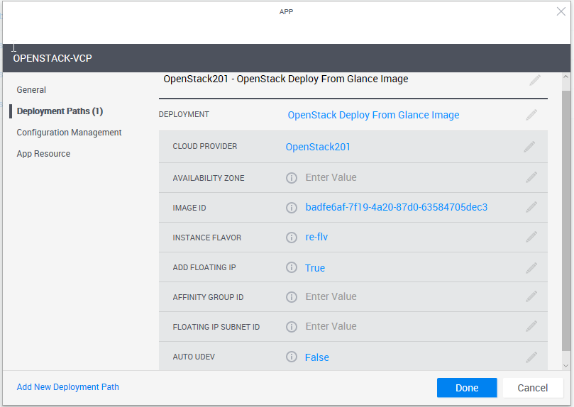
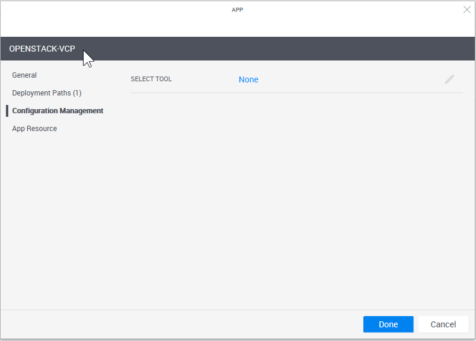
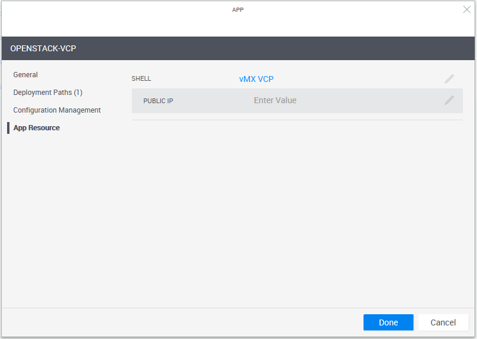

 
##### VFP

    Example app name: openstack-vfp0
    
    Image ID: badfe6af-7f19-4a20-87d0-63584705dec3
    Instance Flavor: pfe-flv
    Add Floating IP: False
    Auto Udev: True
    
    App Resource Shell: vMX VFP

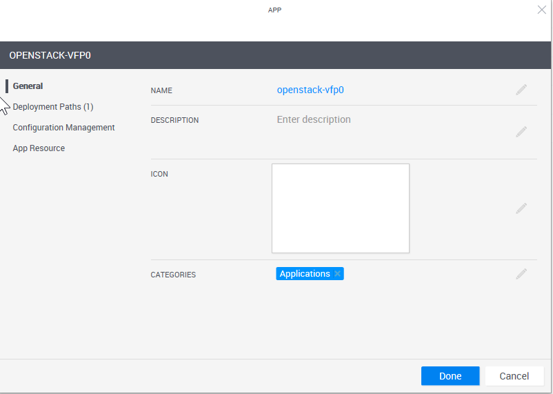
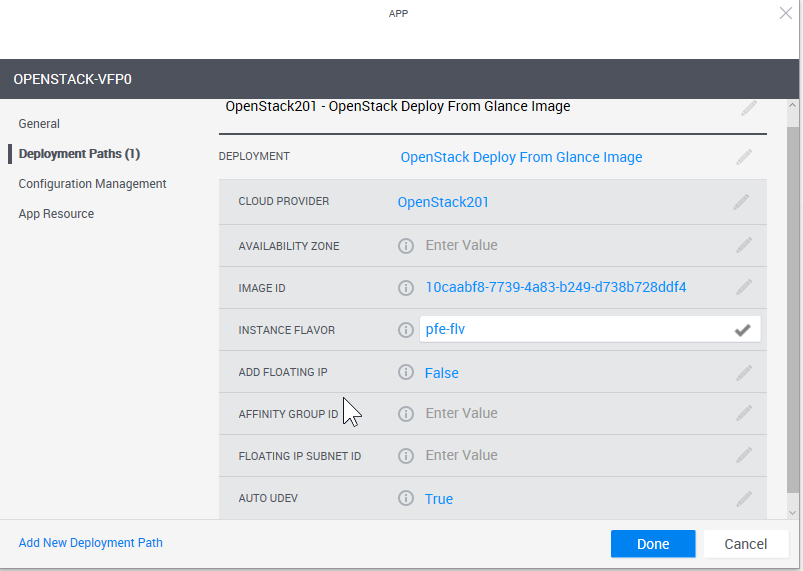
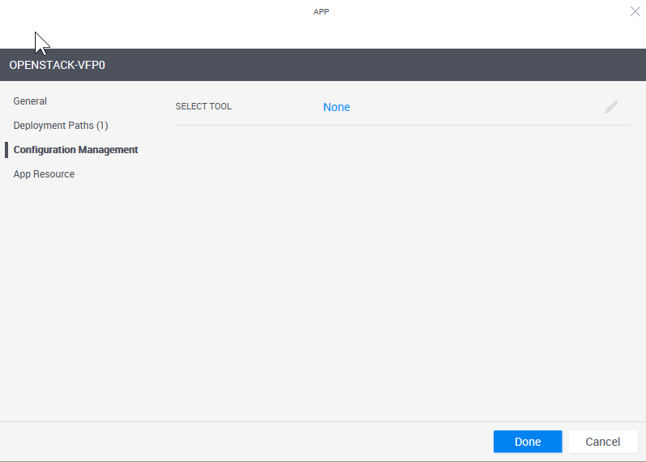
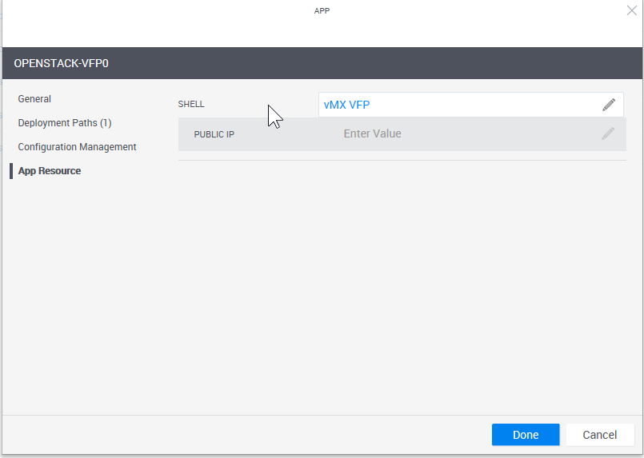

 
If you get these values from the OpenStack web GUI, always be sure you have the right id. 
CloudShell asks for network in some places and subnet in others.
In general, don't trust UUIDs you see in the URL bar &mdash; instead look in the body of the details page.

 
 
## Implementation details

The vMX template resource has port subresources with names like ge-0-0-0. The port family is marked Locked by Default = false
so the same template resource can be used in multiple simultaneous reservations. To use multiple vMX instances in the same reservation,
create more copies of the vMX template resource.

The vMX template resource has a hook function orch_hook_during_provisioning that will be called by the hook_setup setup script
in parallel to standard app deployments.

### Setup

hook_setup calls vMX VNF Deployment Resource Driver.orch_hook_during_provisioning.

It performs the following series of tasks automatically: 
1. Add new vCP app and vFP app(s) to the reservation, with names based on the template resource name
1. Deploy the vCP and vFP(s) using DeployAppToCloudProviderBulk, producing deployed resources of type vMX VCP and vMX VFP
1. Platform-specific:
    - vSphere
        - Add an auto VLAN ('Auto VLAN' or the service name specified in the Internal Network Service attribute) and connect it to NIC #2 of vCP and vFP(s) 
        - With pyVmomi, add a serial console to the vCP to be accessed through an ESXi port in the range 9300..9330 (managed by a CloudShell number allocation pool)
        - Telnet to vCP serial console
            - If the console gets stuck at a boot prompt, reset the VM, up to 5 times
            - Log in as root (no password)
            - Set root password
            - Create username and set password according to resource template attributes
            - Enable SSH
            - Enable DHCP or set static IP on management interface fxp0.0, and determine the final management IP
        - With pyVmomi, determine the mapping from vNIC index (e.g. Network adapter 3) to MAC address
    - OpenStack
        - Power off the vCP and vFP(s)
        - With the Neutron API, create an isolated network and a subnet 128.0.0.0/24 with ports with IPs 128.0.0.1 for the vCP and 128.0.0.16, 128.0.0.17, ... for the vFP(s)
        - With the Nova API, connect the vCP and vFPs to their dedicated ports on the 128.0.0.0/24 network
        - Create a dummy network and attach it to the vFPs (to be removed later in the deployment)
        - Power on the vCP and vFP(s) 
        - Connect via a WebSocket to the vCP serial console
            - Log in as root (no password)
            - Set root password
            - Create username and set password according to resource template attributes
            - Enable SSH
            - Enable DHCP on management interface fxp0.0
            - Determine the DHCP management IP
1. Wait until the vCP is reachable by SSH
1. SSH to the vCP as root using the new password
1. In the vCP's FreeBSD shell, run 'ifconfig' and wait until all expected interface names appear, such as ge-0-0-0. The first number in the interface name indicates the card number. If 3 vFPs were requested, wait until interfaces with names like ge-0-x-x, ge-1-x-x, and ge-2-x-x all appear. This will indicate that the handshake between the vCP and each vFP has taken place. Record the MAC addresses of all ge-x-x-x interfaces of the vCP. These will be MAC addresses on vFP VMs.
1. Create a new resource to represent the vMX. It can be either the gen1 or gen2 JunOS router shell. The family, model, and driver name are specified in the vMX template resource.
1. Set the IP of the vMX resource to the fxp0.0 IP determined earlier (static or DHCP) 
1. Copy all attributes from the vMX template resource to the new vMX resource. This includes critical attributes like User, Password, Enable Password, SNMP version (v2c recommended), SNMP community string (e.g. public), and Enable SNMP (must be true)
1. Run Autoload on the new vMX resource. This will use the standard JunOS driver for router hardware. 
1. If Autoload fails to detect all expected ports, retry several times
1. Create a virtual L2 switch
    - Create one port subresource for each autoloaded vMX port
        - Name: port#, an incremented number starting from 0
        - Attribute `VM Name` with the resource name of the corresponding card VM
        - Attribute `VM Port vNIC Name`
            - for vSphere, the id of the NIC (e.g. 3 for Network adapter 3) that has the MAC that matches the autoloaded vMX port
            - for OpenStack, the last number in the port address, e.g. 3 for ge-0-0-3
1. Set physical connections between:
    - each new vMX resource port
    - its assigned virtual L2 port
1. Move connectors from the vMX template resource to the new vMX resource
1. Add a service VNF Cleanup Service with an attached hook vnf_cleanup_orch_hook_post_teardown
1. Platform-specific:
    - OpenStack
        - Power off the vFP(s)
        - Remove the dummy network connection
        - Power on the vFP(s)

### Teardown
1. Apps are destroyed automatically by the default teardown process and the VMs are automatically 
deleted by the cloud provider 
1. The hook vnf_cleanup_orch_hook_post_teardown on the VNF Cleanup Service deletes the virtual L2 and the 
autoloaded vMX resource

### Virtual L2 operation

Connectors to ports on a vMX resource are translated into cloud provider calls 
that reconfigure the underlying VMs.

#### Structure
Resources like the following examples will exist after deploying from a vMX template resource that requested 2 cards:

- In vCenter:
    - ...
    - `vMX vSphere 1_4253_vfp0_0733d592` Network adapter 4 has MAC `00:50:56:be:50:cb`
    - ...
    - `vMX vSphere 1_4253_vfp0_0733d592` Network adapter 7 has MAC `00:50:56:be:64:ad`
    - ...
    - `vMX vSphere 1_4253_vfp1_12345678` Network adapter 3 has MAC `00:50:56:be:64:45`
    - ...
    - `vMX vSphere 1_4253_vfp1_12345678` Network adapter 6 has MAC `00:50:56:be:50:23`
    - ...
    

- vMX vSphere 1_4253 (Router/Juniper JunOS Router or CS_Router/Juniper JunOS Router 2G) (autoloaded)
    - Chassis 1
        - em1
        - Module 1
            - SubModule 1
                - ge-0-0-0
                    - MAC Address: 00:50:56:be:50:cb
                - ge-0-0-1
                    - MAC Address: 00:50:56:be:64:ad
                - ...                    
            - SubModule 2
                - ge-1-0-0
                    - MAC Address: 00:50:56:be:50:23
                - ge-1-0-1
                    - MAC Address: 00:50:56:be:64:45
                - ...                    

- vMX vSphere 1_4253_vcp_8998ee87 (VNF Card/vMX VCP)
    - No subresources

- vMX vSphere 1_4253_vfp0_0733d592 (VNF Card/vMX VFP)
    - No subresources

- vMX vSphere 1_4253_vfp1_12345678 (VNF Card/vMX VFP)
    - No subresources

- vMX vSphere 1_4253 L2 (Switch/VNF Connectivity Manager Virtual L2)
    - port0
        - VM Name: vMX vSphere 1_4253_vfp0_0733d592
        - VM Port vNIC Name: 4
    - port1
        - VM Name: vMX vSphere 1_4253_vfp0_0733d592
        - VM Port vNIC Name: 7
    - ...
    - port10
        - VM Name: vMX vSphere 1_4253_vfp0_0733d592
        - VM Port vNIC Name: 6
    - port11
        - VM Name: vMX vSphere 1_4253_vfp0_0733d592
        - VM Port vNIC Name: 3
    - ...
   
These physical connections will be set between the virtual L2 and the main vMX resource:

- vMX vSphere 1_4253 L2/port0 <=> vMX vSphere 1_4253/Chassis 1/Module 1/SubModule 1/ge-0-0-0 
- vMX vSphere 1_4253 L2/port1 <=> vMX vSphere 1_4253/Chassis 1/Module 1/SubModule 1/ge-0-0-1
- ...
- vMX vSphere 1_4253 L2/port10 <=> vMX vSphere 1_4253/Chassis 1/Module 1/SubModule 1/ge-1-0-0 
- vMX vSphere 1_4253 L2/port11 <=> vMX vSphere 1_4253/Chassis 1/Module 1/SubModule 1/ge-1-0-1
- ...

After deployment, connectors will have been moved from ports on the vMX template resource such 
as

    vMX Template vSphere 1/ge-0-0-0
    
to ports on the vMX resource such as 

    vMX vSphere 1_4253/Chassis 1/Module 1/SubModule 1/ge-0-0-0

#### ApplyConnectivityChanges on the virtual L2

Because a vMX resource port like

    vMX vSphere 1_4253/Chassis 1/Module 1/SubModule 1/ge-0-0-0

has a physical connection

    vMX vSphere 1_4253 L2/port0 <=> vMX vSphere 1_4253/Chassis 1/Module 1/SubModule 1/ge-0-0-0 
 
the virtual L2 switch driver will receive connect and disconnect requests when visual connectors
going to the vMX resource are connected or disconnected.
 
The virtual L2 driver determines the related card VM, finds the cloud provider of that VM, and 
calls ApplyConnectivityChanges on the cloud provider using ExecuteCommand().

Suppose the user ran Connect on a visual connector going to this port: 

    vMX vSphere 1_4253/Chassis 1/Module 1/SubModule 1/ge-0-0-0

The system would call ApplyConnectivityChanges with a connection request involving 
this port on the virtual L2: 

    vMX vSphere 1_4253 L2/port0

Each connection request contains many details like a VLAN assignment. The connection requests are 
kept mostly as-is, but certain information is overwritten or added.

Attributes of the port resource on the virtual L2:

    Resource: vMX vSphere 1_4253 L2/port0
    VM Name = vMX vSphere 1_4253_vfp0_0733d592
    VM Port vNIC Name = 4
    

VM UUID for both vSphere and OpenStack:
 
    api.GetResourceDetails('vMX vSphere 1_4253_vfp0_0733d592').VmDetails.UID
    

The virtual L2 driver updates the connection request JSON:
    
    ...
    "actionTarget": {
        "fullName": "vMX vSphere 1_4253_vfp0_0733d592",
        "fullAddress": "vMX vSphere 1_4253_vfp0_0733d592"
        ...
    },
    "customActionAttributes": [
        ...
        {
            "attributeName": "VM_UUID",
            "attributeValue": <VmDetails.UID value>
        },
        {
            "attributeName": "Vnic Name",
            "attributeValue": "4"
        },
        ...
    ],
    ...

and calls the cloud provider:

    r = ExecuteCommand(resid, cloud_provider_name, 'Resource', 'ApplyConnectivityChanges', [
        InputNameValue('request', json.dumps({
            'driverRequest': {
                'actions': [
                    <single action JSON object as patched above>
                ]
            }
        }))
    ]).Output
    
A connectivity request with multiple actions is split into a series of connection requests with a single action each. 
They are sent to the cloud provider in ascending order by Vnic Name. This is because the OpenStack cloud provider
currently determines the NIC not from Vnic Name but from the order requests are sent.

The JSON output of the cloud providers ApplyConnectivityChanges calls is accumulated and bundled as the 
output of the virtual L2 ApplyConnectivityChanges. This is critical in order for the system to set attributes 
on the connector that are needed when disconnecting.

On OpenStack, before the connection request is sent, the card VM is powered off by calling the 
cloud provider and powered on again afterward. This is necessary to refresh the VM in OpenStack itself, 
the vMX software, or both.

Note these limitations under OpenStack:
- Interfaces must be chosen starting from the lowest on a card, with no gaps. For example, two connections to the 
first card must use ge-0-0-0 and ge-0-0-1 instead of arbitrary ports like ge-0-0-3 and ge-0-0-6.
- Disconnecting one connection and then connecting a new one will not work in general. You could disconnect ge-0-0-0
and try to reconnect ge-0-0-0, but the system would pick something like ge-0-0-5, one greater than the highest 
interface previously added on that VM.
The only safe way to disconnect some connection and later connect some connection is to run Disconnect on all
connectors for that card and then reconnect all of them, either manually doing Connect on each one in 
ascending order (ge-0-0-0 first) or making a bulk call ConnectRoutesInReservation that will send them all to 
the virtual L2 as a batch without gaps at the bottom. 
- It would break if the standard Setup connectivity phase started to spread the connector endpoints across 
multiple calls to ConnectRoutesInReservation and not all connectors for a single vMX were sent in the 
same ApplyConnectivityChanges batch
- It would break if the system stopped translating a ConnectRoutesInReservation call into a single batch 
call to ApplyConnectivityChanges per L2 provider

